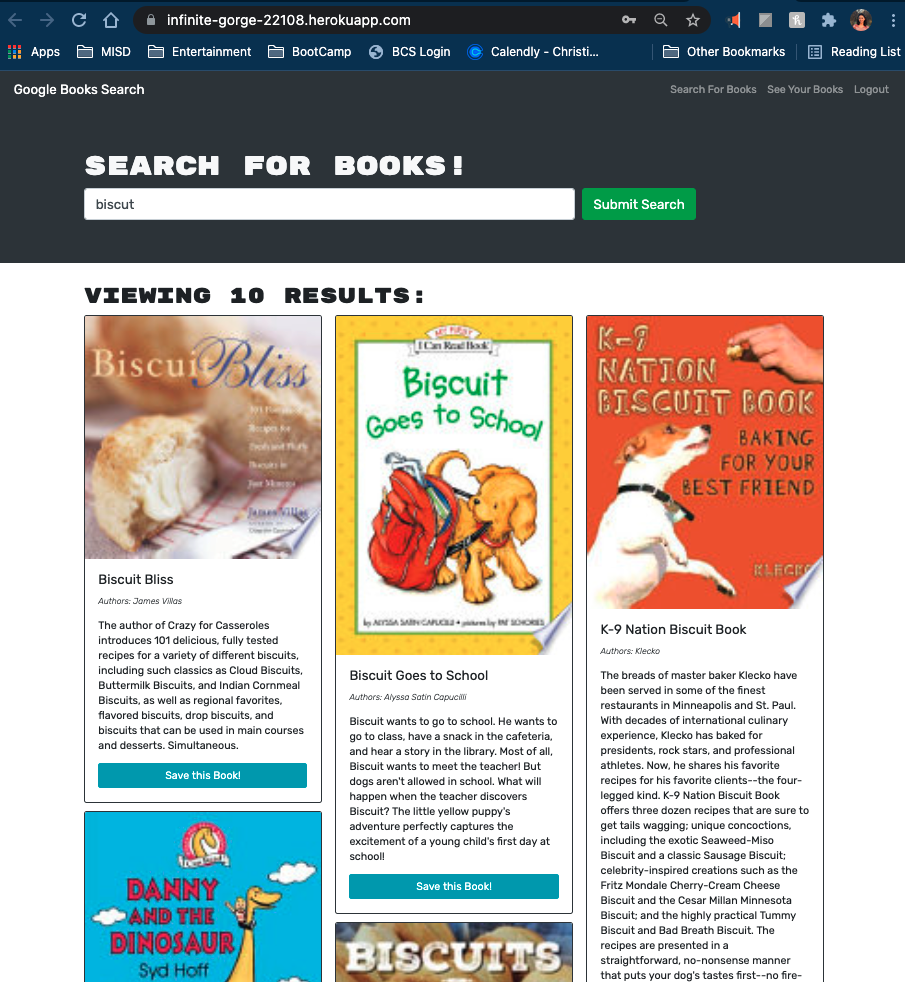

# **Book Search Engine** 

<h2>By Sally Alvarenga</h2>

---

## Description

In this application I used starter code to refactor a Book Search Engine. The application previously rendered its functionality through RESTful API requests, it now renders the information via GraphQL endpoints and the specific set of mutations and queries.

The Book Search Engine is a deployed application in which the user can search for books, create and login to an account, and add the books to their list. In addition to being able to create, update, and display from the Mongo database, this application uses a MongoDB Atlas connection to create the global deployment.

## See Deployed Application: [Book Search Engine](https://infinite-gorge-22108.herokuapp.com/)

Table of Contents

  <ol>
    <li><a href="#Installation">Installation</a></li>
    <li><a href="#usage">Usage</a></li>
    <li><a href="#license">License</a></li>
    <li><a href="#tests">Tests</a></li>
    <li><a href="#questions">Questions</a></li>
  </ol>

---

## Installation

To get started:

- no installation is required to use this browser based application.

## Usage

From the Homepage a user will be able to click on the search bar and search for whatever book they desire. They will then receive a list of book results according to the Google book search API results. If they are logged into an account, the user will then have the option to add the desired book or books to their list.

At the top right of the screen, the user will be able to click on "My List" to see the books that have been saved to their list thus far.

## License

Distributed under the MIT License

    Copyright (c) 2021 Sally Alvarenga

## Tests

Testing and Debugging has already been done by the developer and but feedback will be appreciated for further development.

---

## Questions

For further questions and inquiries please feel free send me an email or a direct message on GitHub

Sally Alvarenga - sallyalvarenga35@gmail.com

GitHub Profile: [https://github.com/salvarenga74/](https://github.com/salvarenga74)
